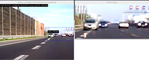
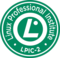



## My Blog

<ul class="posts">
  
    <li>{{ post.date | date_to_string }} &raquo; <a href="{{ BASE_PATH }}{{ post.url }}">{{ post.title }}</a></li>
  
</ul>

## Hobby

### Robotics

### OpenCV 
* [OpenCV](href="http://opencv.org")
* [Object-labeler](https://github.com/peterborkuti/haarselector)

### Learning Machine Learning 
* [Andrew Ng](https://www.coursera.org/course/ml) 
* [Sebastian Thrun](https://www.udacity.com/course/cs373)
* [S. Thrun and Peter Norvig](https://www.udacity.com/course/cs271)

### Learning Electronics 
* [Prof. Anant Agarval](http://ocw.mit.edu/courses/electrical-engineering-and-computer-science/6-002-circuits-and-electronics-spring-2007/)  

## Professional life

### Learning
    

### Working
* [php](http://www.matesz.hu)
* [java](http://www.liferay.com)
* [javascript](https://github.com/peterborkuti/other/JavaScriptBasics)
* [visit me on github](https://github.com/peterborkuti)
